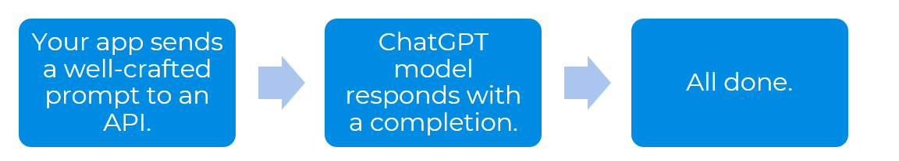
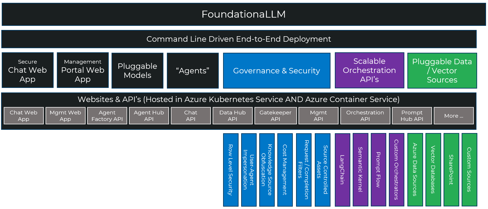
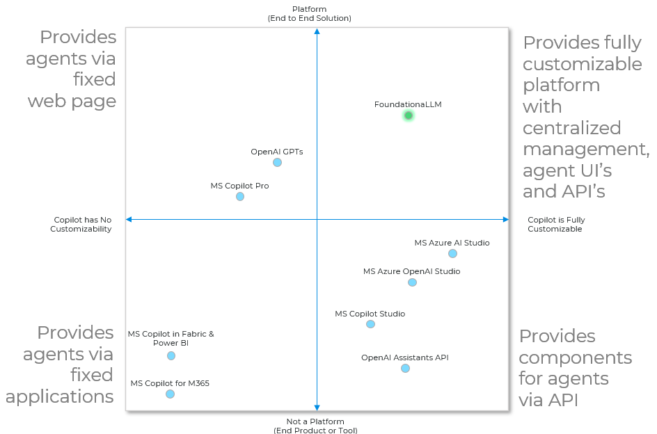

# Welcome to FoundationaLLM!

[FoundationaLLM](https://foundationallm.ai) is a platform accelerating the delivery of secure, trustworthy enterprise generative AI copilots.

## Mission

> We empower organizations through secure Generative AI solutions to unlock controlled disruptive business change.

## Vision

> We envision a world where all organizations have technology driving controlled disruptive business change.

## Core Values

Excellence, Innovation, Transparency, Mission and Impact Focused

---

> [!TIP]
> To get started with FoundationaLLM, check out our [main repository](https://github.com/foundationallm/foundationallm).

## FoundationaLLM: The platform for accelerating the delivery of secure, trustworthy enterprise generative AI copilots 🚀

With FoundationaLLM you can:
- Create AI agents that are grounded in your enterprise data, be that text, semi-structured or structured data. 
- Make AI agents available to your users through a branded chat interface or integrate the REST API to the AI agent into your application for a copilot experience or integrate the Agent API in a machine-to-machine automated process.
- Experiment building agents that can use a variety of large language models including OpenAI GPT-4, Mistral and Llama 2 or any models pulled from the Hugging Face model catalog that provide a REST completions endpoint.
- Centrally manage, configure and secure your AI agents AND their underlying assets including prompts, data sources, vectorization data pipelines, vector databases and large language models using the management portal.
- Enable everyone in your enterprise to create their own AI agents. Your non-developer users can create and deploy their own agents in a self-service fashion from the management portal, but we don't get in the way of your advanced AI developers who can deploy their own orchestrations built in LangChain, Semantic Kernel, Prompt Flow or any orchestration that exposes a completions endpoint.
- Deploy and manage scalable vectorization data pipelines that can ingest millions of documents to provide knowledge to your model.
- Empower your users with as many task-focused AI agents as desired. 
- Control access to the AI agents and the resources they access using role-based access controls (RBAC).
- Harness the rapidly evolving capabilities from Azure AI and Azure OpenAI from one integrated stack. 

> [!NOTE] 
> FoundationaLLM is not a large language model. It enables you to use the large language models of your choice (e.g., OpenAI GPT-4, Mistral, LLama 2, Claude, Gemini etc.) 

FoundationaLLM deploys a secure, comprehensive and highly configurable copilot platform to your Azure cloud environment:

- Simplifies integration with enterprise data sources used by agent for in-context learning (e.g., enabling RAG, CoT, ReAct and inner monologue patterns).
- Provides defense in depth with fine-grain security controls over data used by agent and pre/post completion filters that guard against attack.
- Hardened solution attacked by an LLM red team from inception.
- Scalable solution load balances across multiple LLM endpoints.
- Extensible to new data sources, new LLM orchestrators and LLMs.

### Why is FoundationaLLM Needed?

Simply put we saw a lot of folks reinventing the wheel just to get a customized copilot or AI agent that was grounded and bases its responses in their own data as opposed to the trained parametric knowledge of the model. Many of the solutions we saw made for great demos, but were effectively toys wrapping calls to OpenAI endpoints- they were not something intended or ready to take into production at enterprise scale. We built FoundationaLLM to provide a continuous journey, one that was quick to get started with so folks could experiment quickly with LLM's but not fall off a cliff after that with a solution that would be insecure, unlicensed, inflexible and not fully featured enough to grow from the prototype into a production solution without having to start all over.  

The core problems to deliver enterprise copilots or AI agents are:

- Enterprise grade copilots or AI agents are complex and have lots of moving parts (not to mention infrastructure).
- The industry has a skills gap when it comes to filling the roles needed to deliver these complex copilot solutions.
- The top AI risks (inaccuracy, cybersecurity, compliance, explainability, privacy) are not being mitigated by individual tools.
- Delivery of a copilot or AI agent solution is time consuming, expensive and frustrating when starting from scratch.

### The Misconception vs Reality
#### Misconception
There is a misconception that building LLM apps and AI agents is all about prompt engineering, it’s as easy as:

That may be true for demos and toy scenarios, but for AI agents in the enterprise there are many more requirements such as how do you:
 - scale and batch load thousands to millions of documents as knowledge for the model?
 leverage other LLM’s (Llama 2, Mistral) alongside ChatGPT models?
 - keep sensitive knowledge sources private to authorized users?
 - keep sensitive data (PII, trade secrets) from being sent to the LLM?
 - manage having multiple AI agents?
 - govern token use and manage charge backs for applications?

#### Reality
There are a lot of components that go into building a secure, well governed, scalable and extensible AI agent and FoundationaLLM provides a comprehensive stack to make this process faster, more repeatable and more reliable:

### Where does FoundationaLLM sit relative to other solutions?
There are a lot of great tools in the ecosystem that help with parts of building a copilot or an AI agent. Only FoundationaLLM brings them together to provide the end-to-end platform for creating fully customizable AI agents with centralized management, agent UI's and API's.

At its most basic, a copilot or AI agent uses enterprise supplied knowledge and generative AI models to author text, write code or render images, often by reasoning over human supplied prompts. Across these modalities, the AI is used to assist a human directly with a specific task.  

This basic capability emerges in two archetypes, both of which FoundationaLLM supports natively: 

- Knowledge Management: Help users quickly find the information they seek and deliver at the right level and in the right format. Examples include summarization, rephrasing or retargeting to address a persona (e.g., explain it like I'm five), sentiment analysis and recommendations.
- Analytics: Help users quickly get to the data driven insights they seek. Examples include recommendations, predictions, anomaly detection, statistical analysis and data querying and reporting.

FoundationaLLM simplifies and streamlines building *knowledge management* (e.g., question/answer agents) and *analytic* (e.g., self-service business intelligence) agents over the data sources present across your enterprise. 

> [!TIP]
> Check out our main repository at [FoundationaLLM](https://github.com/foundationallm/foundationallm) for more information on how to get started with FoundationaLLM.
